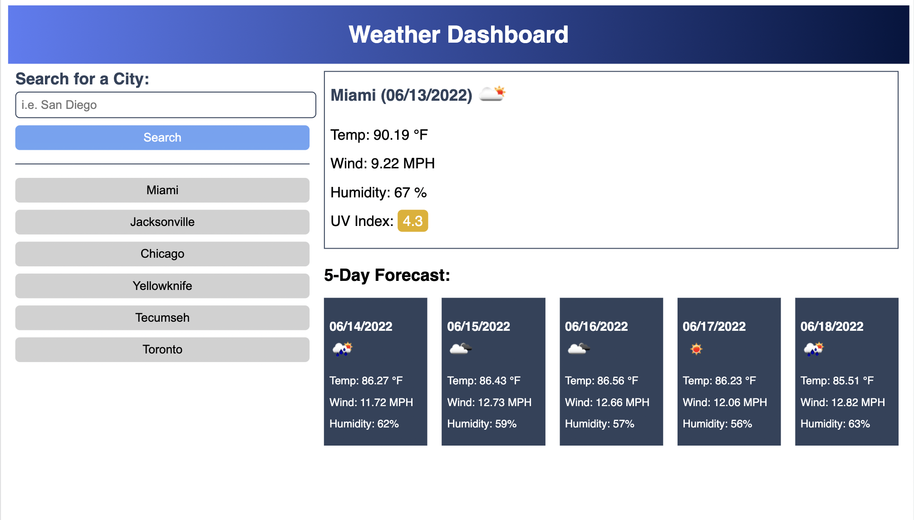

# Weather-Dashboard

## Description

- The Weather Dashboard repository was created to build an application for users to search for weather data based on their desired city.
- This project was created to strengthen my proficiency working with server-side APIs and to reinforce existing HTML, CSS and JavaScript skills. 
- The Weather Dashboard application can be used to search for current weather information for your city as well as the forecasted weather for the next 5 days. It's color coding feature indicates whether the UVI is favorable, moderate or severe and an icon is displayed to help give a sense of the overall weather conditions.
- Creating the Weather Dashboard provided considerable opportunities to troubleshoot and debug code, utlilize server-side APIs and pracice executing proper JavaScript syntax, especially the use of arguments and parameters to pass variables between functions.

### Page Preview

### Link to Application

[View in browser](https://katiebutler37.github.io/weather-dashboard/)